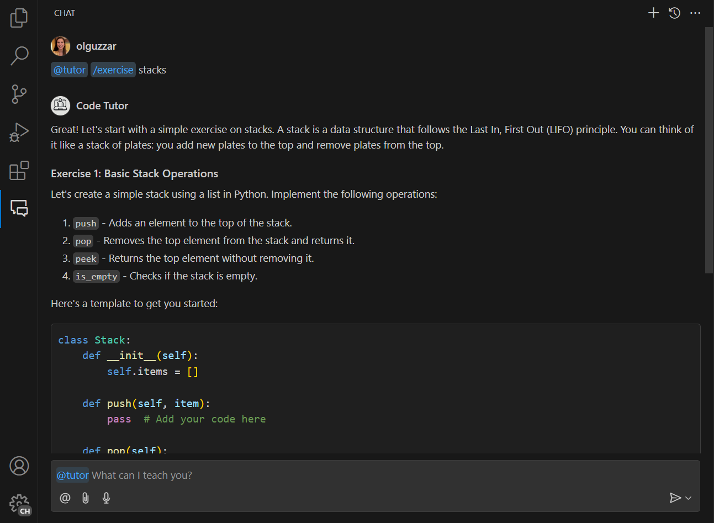

# Chat Tutorial

Visual Studio Code's Copilot Chat architecture enables extension authors to integrate with the GitHub Copilot Chat experience. A chat extension is a VS Code extension that uses the Chat extension API by contributing a Chat participant. Chat participants are domain experts that can answer user queries within a specific domain.

This GitHub Copilot Extension sample shows:

- How to contribute a chat participant to the GitHub Copilot Chat view.

Documentation can be found here:
- https://code.visualstudio.com/api/extension-guides/chat
- https://code.visualstudio.com/api/extension-guides/chat-tutorial

## Running the Sample

- Run `npm install` in terminal to install dependencies
- Run the `Run Extension` target in the Debug View. This will:
	- Start a task `npm: watch` to compile the code
	- Run the extension in a new VS Code window
	- You will see the @tutor chat participant in the GitHub Copilot Chat view
