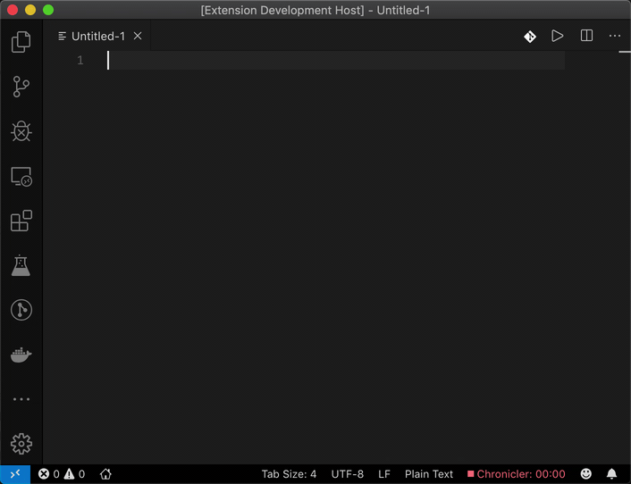

# CodeLens Sample

This is a sample extension that shows the usage of the CodeLens API.

It is not intended as a production quality extension.

- Create a new file
- Write anything
- Click on the CodeLens for action example
- Can be enabled or disabled by command palete

## Demo

## VS Code API

### `languages` module

- [`languages.registerCodeLensProvider`](https://code.visualstudio.com/api/references/vscode-api#languages.registerCodeLensProvider)

### CodeLens Provider

- [`CodeLensProvider`](https://code.visualstudio.com/api/references/vscode-api#CodeLensProvider)
- [`CodeLensProvider.provideCodeLenses`](https://code.visualstudio.com/api/references/vscode-api#CodeLensProvider.provideCodeLenses)
- [`CodeLensProvider.resolveCodeLens`](https://code.visualstudio.com/api/references/vscode-api#CodeLensProvider.resolveCodeLens)

## Running the Sample

- Run `npm install` in terminal to install dependencies
- Run the `Run Extension` target in the Debug View. This will:
	- Start a task `npm: watch` to compile the code
	- Run the extension in a new VS Code window