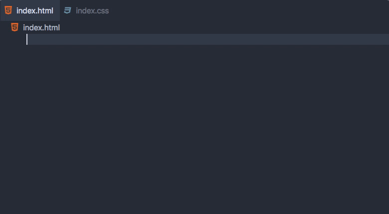

# Custom Data Sample

This demonstrates packaging [custom data](https://github.com/microsoft/vscode-custom-data) into a VS Code extension.

Guide for this sample: https://code.visualstudio.com/api/extension-guides/custom-data-extension.

## Demo

## VS Code API

### Contribution Points

- [`contributes.html.customData`](https://code.visualstudio.com/api/extension-guides/custom-data-extension)
- [`contributes.css.customData`](https://code.visualstudio.com/api/extension-guides/custom-data-extension)

## Running the Sample

- Run the `Run Extension` target in the Debug View.
- Open a HTML file. You should receive auto completion and hover information for the HTML entities defined in `html.html-data.json`.
- Open a CSS file. You should receive auto completion and hover information for the CSS entities defined in `css.css-data.json`.