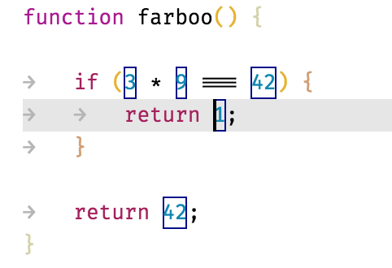

# Decorator Sample

This folder contains a sample VS code extension that demonstrates the editor decorator API.

The sample creates a decoration for each number that appears in the active editor. It
demonstrates some of the decorator features such as borders, background colors, cursors
and hovers.

The sample also shows the use of a user defined themeable color. Instead of hardcoding a color value this allows users (and themes) to redefine the color in the user settings.



## VSCode API

The sample code show the usage of the vscode.[`TextEditor.setDecorations`](https://code.visualstudio.com/api/references/vscode-api#TextEditor.setDecorations) and [`vscode.window.createTextEditorDecorationType`](https://code.visualstudio.com/api/references/vscode-api#window.createTextEditorDecorationType) APIs as well as the `colors` contribution point.

## Running the Sample

* `npm install` to initialize the project
* `npm run watch` to start the compiler in watch mode
* open this folder in VS Code and press `F5`
* this will open the `[Extension Development Host]` window, running the extension:
  * Open any document that contains single and multi-digit numbers.
  * The extension will decorate single and multiple-digit numbers as shown in the screenshot above.
  * In the user settings, add
    ```
    "workbench.colorCustomizations": {
        "myextension.largeNumberBackground": "#ff00ff"
    }
    ```
    to customize the large number decoration color.
