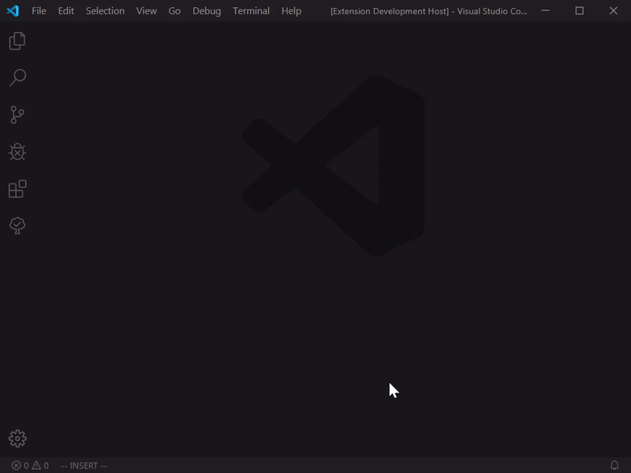

# Document Editing Sample

This is an example that shows you how to create a command which makes changes to the document in the active editor.

## Demo

## VS Code API

### `vscode` module

- [`commands.registerCommand`](https://code.visualstudio.com/api/references/vscode-api#commands.registerCommand)
- [`window.activeTextEditor`](https://code.visualstudio.com/api/references/vscode-api#window.activeTextEditor)
- [`TextDocument.getText`](https://code.visualstudio.com/api/references/vscode-api#TextDocument.getText)
- [`TextEditor.edit`](https://code.visualstudio.com/api/references/vscode-api#TextEditor.edit)
- [`TextEditorEdit`](https://code.visualstudio.com/api/references/vscode-api#TextEditorEdit)

### Contribution Points

- [`contributes.commands`](https://code.visualstudio.com/api/references/contribution-points#contributes.commands)

## Running the Sample

- Run `npm install` in terminal to install dependencies
- Run the `Run Extension` target in the Debug View. This will:
	- Start a task `npm: watch` to compile the code
	- Run the extension in a new VS Code window
