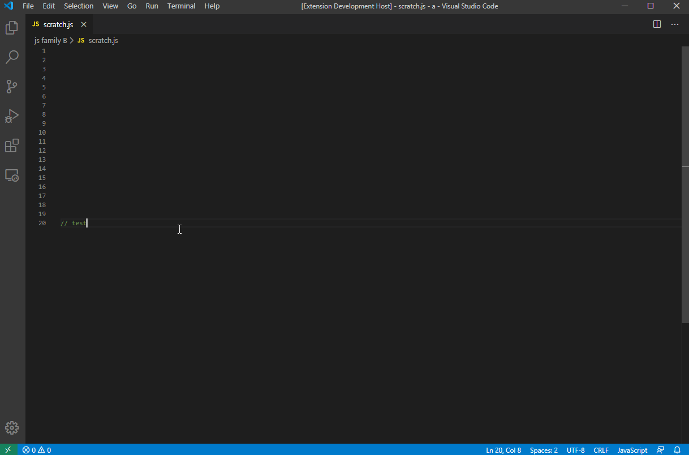

# Document Insert Sample

This is an example that shows you how to create a command that can insert and delete random text in `Line 1`, insert random text in selected line, delete selected text and delete text in selected line.

## Demo

## VS Code API

### `vscode` module

- [`commands.registerCommand`](https://code.visualstudio.com/api/references/vscode-api#commands.registerCommand)
- [`window.activeTextEditor`](https://code.visualstudio.com/api/references/vscode-api#window.activeTextEditor)
- [`TextEditor`](https://code.visualstudio.com/api/references/vscode-api#TextEditor)
- [`TextEditor.edit`](https://code.visualstudio.com/api/references/vscode-api#TextEditor.edit)
- [`TextEditorEdit`](https://code.visualstudio.com/api/references/vscode-api#TextEditorEdit)
- [`TextEditorEdit.insert`](https://code.visualstudio.com/api/references/vscode-api#TextEditorEdit.insert)
- [`TextEditorEdit.replace`](https://code.visualstudio.com/api/references/vscode-api#TextEditorEdit.replace)
- [`TextEditorEdit.delete`](https://code.visualstudio.com/api/references/vscode-api#TextEditorEdit.delete)
- [`Position`](https://code.visualstudio.com/api/references/vscode-api#Position)
- [`Range`](https://code.visualstudio.com/api/references/vscode-api#Range)
- [`Selection`](https://code.visualstudio.com/api/references/vscode-api#Selection)
- [`Selection.anchor`](https://code.visualstudio.com/api/references/vscode-api#Selection.anchor)
- [`Selection.start`](https://code.visualstudio.com/api/references/vscode-api#Selection.start)

### Contribution Points

- [`contributes.commands`](https://code.visualstudio.com/api/references/contribution-points#contributes.commands)
