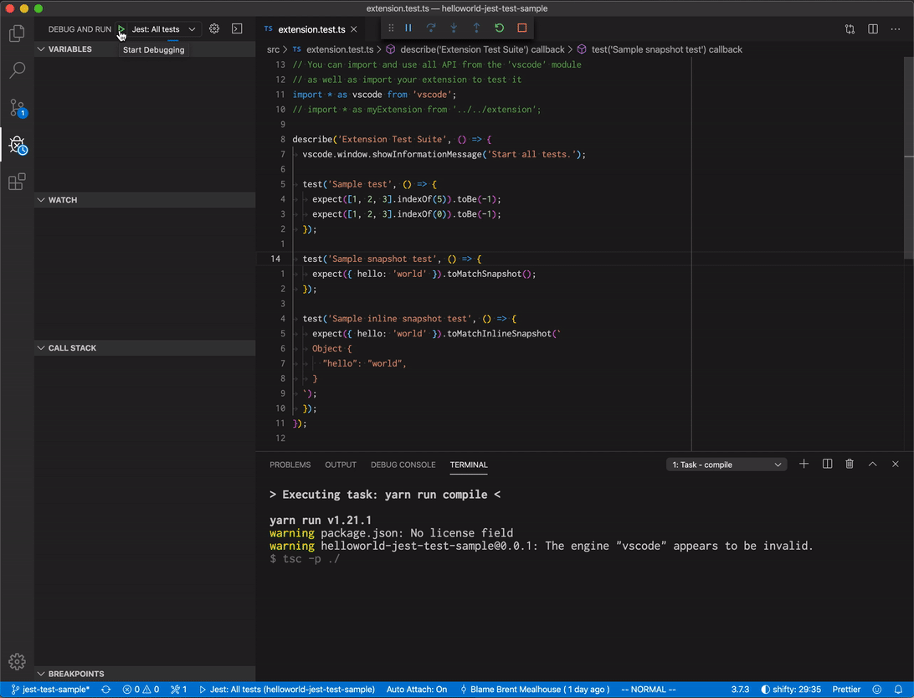

# Hello World Jest Test Sample

This is the Hello World example with jest integration tests setup.

You can find the accompanying documentation at:

- https://code.visualstudio.com/api/working-with-extensions/testing-extension#testing-extension-with-jest
- https://github.com/bmealhouse/vscode-jest-test-runner

## Demo

## Running the Sample

- Run `npm install` in terminal to install dependencies
- Run the `Jest: All tests` target in the Debug View. This will:
  - Start a task `npm: compile` to compile the code
  - Run the extension integration test in a new VS Code window
