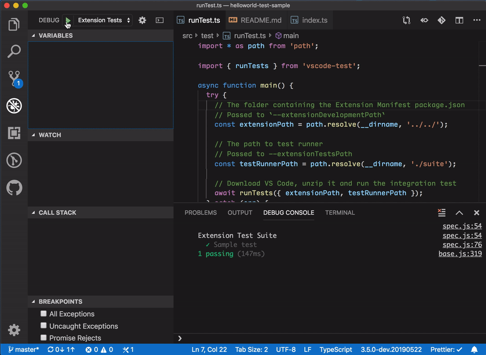

# Hello World Test Sample

This is the Hello World example with integration tests setup.

You can find the accompanying documentation at https://code.visualstudio.com/api/working-with-extensions/testing-extension.

## Demo

## Running the Sample

- Run `npm install` in terminal to install dependencies
- Run the `Run Extension Tests` target in the Debug View. This will:
	- Start a task `npm: watch` to compile the code
	- Run the extension integration test in a new VS Code window
