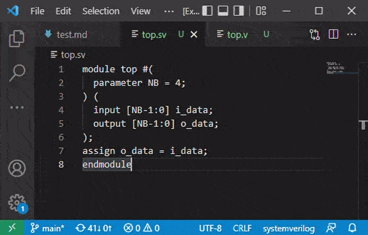

# Hover Provider Sample

Demonstrate the use of [registerHoverProvider](https://code.visualstudio.com/api/references/vscode-api#languages.registerHoverProvider), to show quick information when pointing some context with the mouse.

Here is how it work without syntax highlight installed

If an extension providing language support for Verilog or SystemVerilog is provided, then the the code in the tooltip will be highlighted as well.
