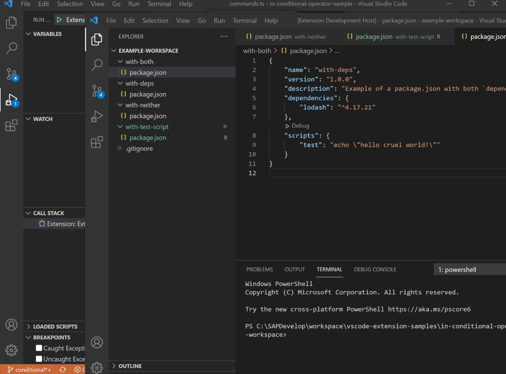

# `in` Conditional Operator Sample

This example demonstrates the usage of the "when clause" [`in` conditional operator`](https://code.visualstudio.com/api/references/when-clause-contexts#in-conditional-operator)
To create **dynamic** context menus based on **custom** provided logic.

In this example we have two context menus entries when right-clicking on `package.json` files.
These entries should only be displayed to the end-user under specific conditions:
- `Install Dependencies` should only appear if the **specific** `package.json` file includes
   a dependencies or devDependencies section.
- `Run Tests` should only appear if the **specific** `package.json` includes a `scripts.test` section.   

## Demo

## VS Code API

### `vscode` module

- [`workspace.findFiles`](https://code.visualstudio.com/api/references/vscode-api#workspace.findFIles)
- [`workspace.createFileSystemWatcher`](https://code.visualstudio.com/api/references/vscode-api#workspace.createFileSystemWatcher)
- [`commands.registerCommand`](https://code.visualstudio.com/api/references/vscode-api#commands.registerCommand)
- [`commands.executeCommand`](https://code.visualstudio.com/api/references/vscode-api#commands.executeCommand)
- [`tasks.executeTask`](https://code.visualstudio.com/api/references/vscode-api#tasks.executeTask)

### Contribution Points

- [`contributes.commands`](https://code.visualstudio.com/api/references/contribution-points#contributes.commands)
- [`contributes.menus`](https://code.visualstudio.com/api/references/contribution-points#contributes.menus)

## Running the Sample

- Run `npm install` in terminal to install dependencies.
- Run `npm compile` in terminal to compile the sources.
- Run the `Run Extension` target in the Debug View this will run the extension in a new VS Code window.
- `file` --> `Open Folder` --> [`example-workspace`](./example-workspace) in the new VS Code window.
- Wait a few seconds for the file watcher to initialize the context state. 
- Right click on the four different `package.json` files available in that folder and
  note how the `Install Dependencies` and `Run Tests` context menus only appear where relevant.
