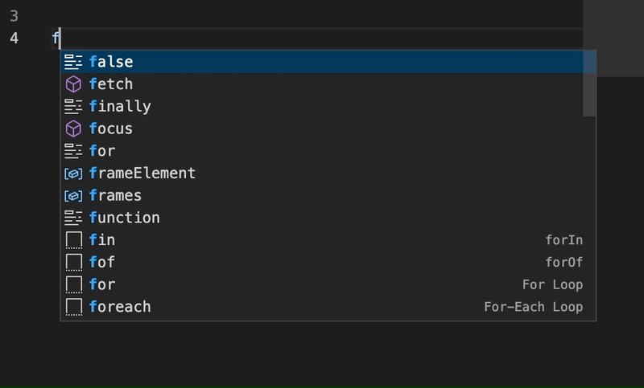

# Inline Completions Sample

This sample demonstrates usage of the proposed inline completions API.

The `postinstall` script uses `vscode-dts dev && vscode-dts main` to download latest version of [`vscode.d.ts`](https://github.com/microsoft/vscode/blob/main/src/vs/vscode.d.ts) and [`vscode.proposed.d.ts`](https://github.com/microsoft/vscode/blob/main/src/vs/vscode.proposed.d.ts) from the master branch of [microsoft/vscode](https://github.com/microsoft/vscode).

You can read more about `vscode-dts` at: https://github.com/microsoft/vscode-dts.

- ⚠️ This sample can only be used for extension development in [Insider release](https://code.visualstudio.com/insiders/). You cannot publish extensions using Proposed API.
- You need `"enableProposedApi": true` in `package.json`.



## VS Code API

Not documented, as the used API is not finalized.


## Running the Sample

- Run `npm install` in terminal to install dependencies
- A `postinstall` script would download latest version of `vscode.proposed.d.ts`
- Run the `Run Extension` target in the Debug View. This will:
	- Start a task `npm: watch` to compile the code
	- Run the extension in a new VS Code window

Make sure that `showInlineCompletions` is enabled in your settings!
```
"editor.inlineSuggest.enabled": true
```
