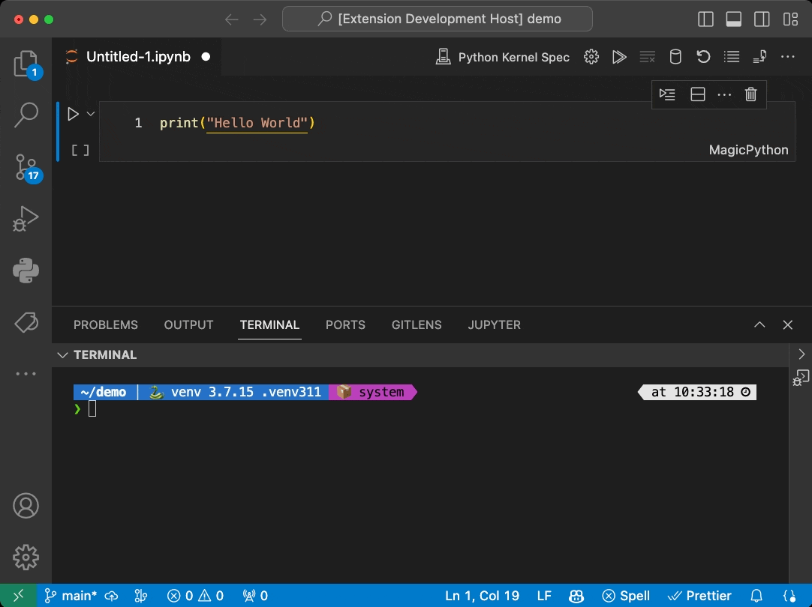

# Jupyter Server Provider Sample

This is a very simple extension sample demonstrating the use of the Jupyter Extension API allowing other extensions to contribute [Jupyter](https://jupyter.org/) Servers via the Kernel Picker for Jupyter notebooks:

- The sample extension finds Jupyter Servers running locally on the current machine
- This list of servers is then provided to the Jupyter extension via the Jupyter Extension API
- Upon opening a notebook and selecting a kernel the option `Local JupyterLab Servers...` will display the above servers.
- From there, the user can select a kernel and run code in the notebook against one of the local kernels.
- Sample showcases the use of the `back` button to allow the user to go back to the previous step.
- Sample showcases the use of custom quick picks to get additional information from the user.

## Running this sample

 1. `cd jupyter-server-provider-sample`
 1. `code .`: Open the folder in VS Code
 1. Run `npm install` in terminal to install dependencies
 1. Run the `Run Extension` target in the Debug View. This will:
	- Start a task `npm: watch` to compile the code
	- Run the extension in a new VS Code window
 1. Select the kernel Picker for a notebook and select the option `Local JupyterLab Servers...`
 1. To see servers show up in this list, start JupyterLab or Jupyter Notebook outside VS Code or from within the integrated terminal (e.g. [jupyter lab](https://jupyterlab.readthedocs.io/en/stable/getting_started/starting.html))

### Guidelines

1. When displaying a custom UI in the kernel picker, please ensure to add a `back` button to allow the user to go back to the previous step.
The sample shows the use of the `back` button and how throwing `CancellationError` vs returning `undefined` helps Jupyter extension distinguish between `cancel` vs `back` behaviour.
2. Minimize creating multiple collections, as this will result in multiple steps to selecting a kernel.

