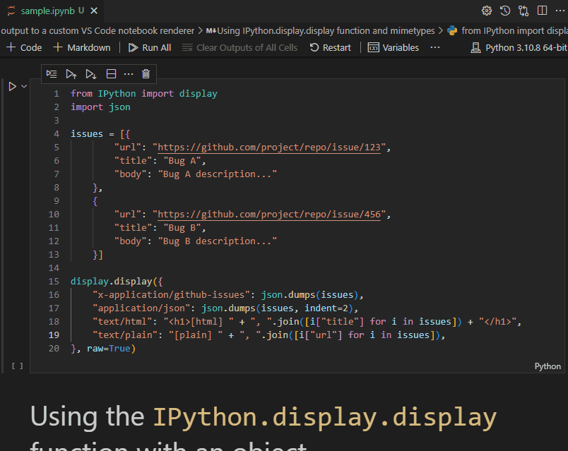

# notebook-renderer-sample

Demonstrates a custom [notebook renderer](https://code.visualstudio.com/api/extension-guides/notebook#notebook-renderer) in VS Code. This creates a custom renderer called `GitHub Issues Plain Renderer` that renders output in a [GitHub Issues Notebook](https://marketplace.visualstudio.com/items?itemName=ms-vscode.vscode-github-issue-notebooks).

This starter includes:

- 🖥️ TypeScript code to create a simple `NotebookOutputRenderer`
- 📦 A Webpack build for the renderer
- 🎨 CSS modules support

## Running this Sample

Ensure you have a Python installed to actually run the sample and invoke the renderer.

 1. `cd notebook-renderer-sample`
 1. `code .`: Open the folder in VS Code Insiders
 1. Hit `F5` to build+debug
 1. Run the sample notebook
 1. Switch the output rendering by clicking [...] button next to the cell output and then _Change Presentation_

When you select the `x-application/github-issues`, the custom renderer will be invoked.

