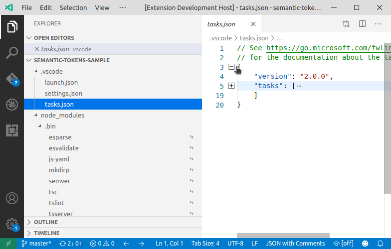

# Product Icon Theme Samples

[Product icons themes](https://code.visualstudio.com/api/extension-guides/product-icon-theme) allow theme authors to customize the icons used in VS Code's built-in views: all icons except file icons (covered by file icon themes) and icons contributed by extensions.

This sample provides a product icon theme with icons used in VS Code 1.0.

The sample also contains a build script that creates the icon font from svg images.

## Demo

VSCode V1.0 Icons

## VS Code API

### Contribution Points

- [contributes.productIconThemes](https://code.visualstudio.com/api/references/contribution-points#contributes.productIconThemes)

## Running the sample

- Press `F5` to open a new window with your extension loaded.
- The extension development host window will automatically select the theme defined in the extension. To manually select a product icon theme, run the `Preferences: Product Icon Theme` command and select your theme.

## Make changes

To add or change icons in the icon font:

- add or change the svg icons to the `icons/` folder
- update the `build/updateFont.js` file to add the new icon names to list of icons
- run `npm run updateFont`
- run `npm run showFont` to open `theme/vscode-10.html` in a browser. The page shows the icons in the font.

To change the icon theme:

- modify `theme/v1-product-icon-theme.json` to associate font icons to VS Code icon IDs
- test the theme by running the extension (`F5`)
- changes to the product theme file are applied live in the extension development host window. No need to relaunch the extension.