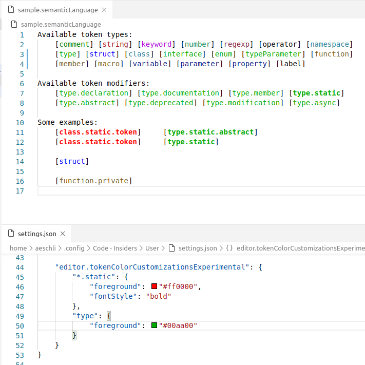

# Semantic tokens sample

This is an extension sample showing a very simple semantic tokens provider. This semantic tokens provider always returns all the tokens in a file.



## How to run

Launch the extension and open the file `sample/sample.semanticLanguage` and use the following settings:

```json
"editor.tokenColorCustomizationsExperimental": {
	"*.static": {
		"foreground": "#ff0000",
		"fontStyle": "bold"
	},
	"type": {
		"foreground": "#00aa00"
	}
}
```
