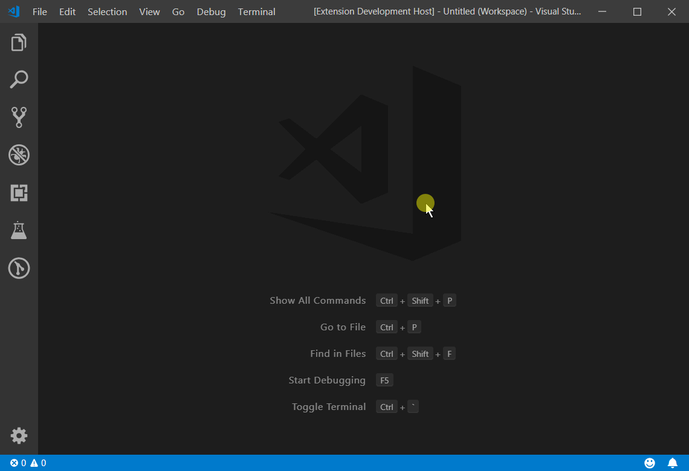
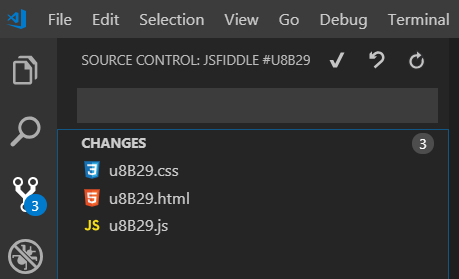
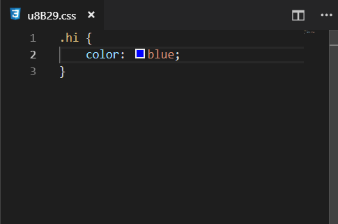

# Source Control Sample

This sample implements a minimal source control provider. It shows how the source control experience in VS Code could be used to for example interact with code in JSFiddle.



Activate the extension by invoking the `Open JSFiddle` command. This invokes following 4 lines, which does the following:

1. creates the custom source control provider associated with the workspace folder
1. creates the source control resource group to later show the local changes to the files in the repository
1. registers the `quickDiffProvider`, which implements the mapping between the documents in the remote repository and documents in the local folder.

```javascript
this.jsFiddleScm = vscode.scm.createSourceControl('jsfiddle', 'JSFiddle #' + fiddle.hash, workspaceFolder.uri);
this.changedResources = this.jsFiddleScm.createResourceGroup('workingTree', 'Changes');
this.fiddleRepository = new FiddleRepository(workspaceFolder, fiddle.hash);
this.jsFiddleScm.quickDiffProvider = this.fiddleRepository;
```



See `fiddleSourceControl.ts` for full code listing.

The three commands (command, roll-back and refresh) in the title of the source control view pane are configured this way:

```JSON
"contributes": {
	"commands": [
		...
	],
	"menus": {
		"scm/title": [
			{
				"command": "extension.source-control.commit",
				"group": "navigation",
				"when": "scmProvider == jsfiddle"
			},
			{
				"command": "extension.source-control.discard",
				"group": "navigation",
				"when": "scmProvider == jsfiddle"
			},
			{
				"command": "extension.source-control.refresh",
				"group": "navigation",
				"when": "scmProvider == jsfiddle"
			}
		]
	}
},
```

It is also worth noting that the sample extension needs to overcome reloading that VS Code triggers when a new workspace folder is added. This is done by writing a memo into the `context.globalState` and reading it upon the next extension activation.

## Status bar controls

The custom source control can add its own controls to the status bar. This typically needs to be refreshed everytime a new version/branch is checked-out.

```javascript
this.jsFiddleScm.statusBarCommands = [
	{
		"command": "extension.source-control.checkout",
		"title": `↕ ${this.fiddle.hash} #${this.fiddle.version} / ${this.latestFiddleVersion}`,
		"tooltip": "Checkout another version of this fiddle.",
	}
];
```


The command `extension.source-control.checkout` displays quick pick of the JSFiddle versions to check-out.

## Populating changed files view

The extension listens to changes to files in the workspace folder and compares the new document text to the version originally checked out from the repository. When it differs, it creates `vscode.SourceControlResourceState` for every changed document assigns such list to `this.changedResources.resourceStates`, where the `this.changedResources` was created earlier.

```JS
{
	resourceUri: doc.uri,
	command: {
		title: "Show changes",
		command: "vscode.diff",
		arguments: [repositoryUri, doc.uri, `Checked-out version ↔ Local changes`],
		tooltip: "Diff your changes"
	}
}
```

where `repositoryUri` is determined by

```JS
this.fiddleRepository.provideOriginalResource(doc.uri, null)
```

## Quick diff

Both the regular diff (invoking the built-in `vscode.diff` when user clicks on the changed resource in the source control view) and the Quick Diff (available in the left margin of the text editor) are rendered automatically by VS Code as long as the extension provides it with the content of the original document checked out from the repository. This is done by implementing a `TextDocumentContentProvider`.


