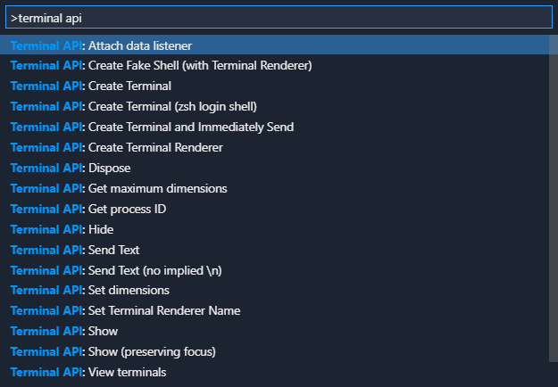

# vscode-terminal-api-example

This sample provides several commands that demonstrates how to utilize the integrated terminal extension API. Access the commands through the command palette (F1).

## VS Code API

### `vscode` module

- [window.createTerminal](https://code.visualstudio.com/api/references/vscode-api#window.createTerminal)
- [window.onDidChangeActiveTerminal](https://code.visualstudio.com/api/references/vscode-api#window.onDidChangeActiveTerminal)
- [window.onDidCloseTerminal](https://code.visualstudio.com/api/references/vscode-api#window.onDidCloseTerminal)
- [window.onDidOpenTerminal](https://code.visualstudio.com/api/references/vscode-api#window.onDidOpenTerminal)
- [window.Terminal](https://code.visualstudio.com/api/references/vscode-api#window.Terminal)
- [window.terminals](https://code.visualstudio.com/api/references/vscode-api#window.terminals) 

### Proposed API

- `window.createTerminalRenderer`
- `window.TerminalRenderer`
- `window.registerTerminalProfileProvider`

### Contribution Points

- [`contributes.commands`](https://code.visualstudio.com/api/references/contribution-points#contributes.commands)
- [`contributes.terminal`](https://code.visualstudio.com/updates/v1_57#_terminal-profile-contributions)

## Running the Sample

- Run `npm install` in terminal to install dependencies
- Run the `Run Extension` target in the Debug View. This will:
	- Start a task `npm: watch` to compile the code
	- Run the extension in a new VS Code window
