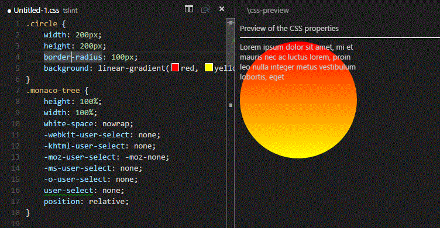

# CSS Properties Preview Sample
This is an sample extension that illustrates the use of virtual documents or `TextDocumentContentProviders` together with the `vscode.previewHtml` 
[command](https://code.visualstudio.com/docs/extensionAPI/vscode-api-commands#_commands). 

It is not intended as a product quality extension.

The purpose of the extension is to show a preview of the properties in the declaration block of a CSS rule. To play with the extension:
- Open a CSS file
- Use `Show CSS Properties Preview`
- Position the cursor inside the declaration block of the rule
- The properties are rendered in the preview
- Edit the propertis and the preview is updated

# How it works

- The extension implements and registers a `TextDocumentProvider` for a particular resource URI. 
- The TextDocumentProvider creates a HTML document that contains the declaration block of the selected CSS Rule in the active editor. 
- The generated HTML document is then opened in an editor in the 2nd Column using the command `vscode.previewHtml`. 

