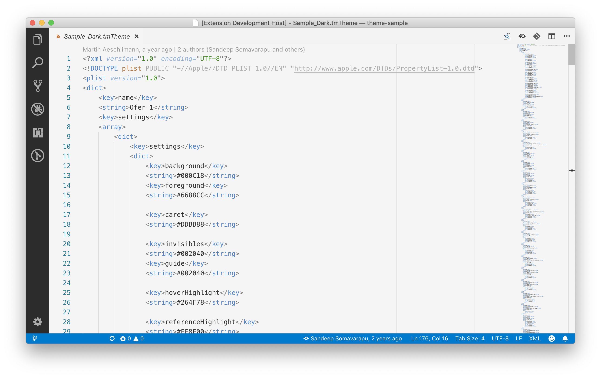
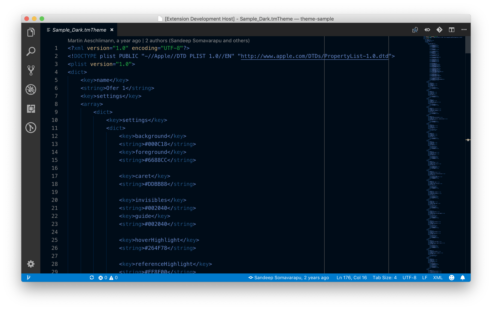

# Theme Samples

This sample color theme extension contains two TextMate themes. 

Text Mate themes describe the theming rules used for syntax highlighting. Each rule consists of one or more scope selectors and a set of styles. To learn more about scopes and how they're used, check out the [color theme](https://code.visualstudio.com/api/extension-guides/color-theme) documentation.

You can directly use .tmTheme files in your extensions or import/convert them with VS Code's extension generator [yo code](https://code.visualstudio.com/api/get-started/your-first-extension).

## Demo

Sample Light

Sample Dark

## VS Code API

### Contribution Points

- [contributes.themes](https://code.visualstudio.com/api/references/contribution-points#contributes.themes)

## Running the sample

- Press `F5` to open a new window with your extension loaded.
- Open `File > Preferences > Color Themes` (or `Code > Preferences > Color Theme` on macOS), and pick `Sample Light` or `Sample Dark`.
- Open a file that has a language associated. The languages' configured grammar will tokenize the text and assign 'scopes' to the tokens. To examine these scopes, invoke the `Inspect TM Scopes` command from the Command Palette (`Ctrl+Shift+P` or `Cmd+Shift+P` on Mac) .

## Make changes

- You can relaunch the extension from the debug toolbar after making changes to the files listed above.
- You can also reload (`Ctrl+R` or `Cmd+R` on Mac) the VS Code window with your extension to load your changes.