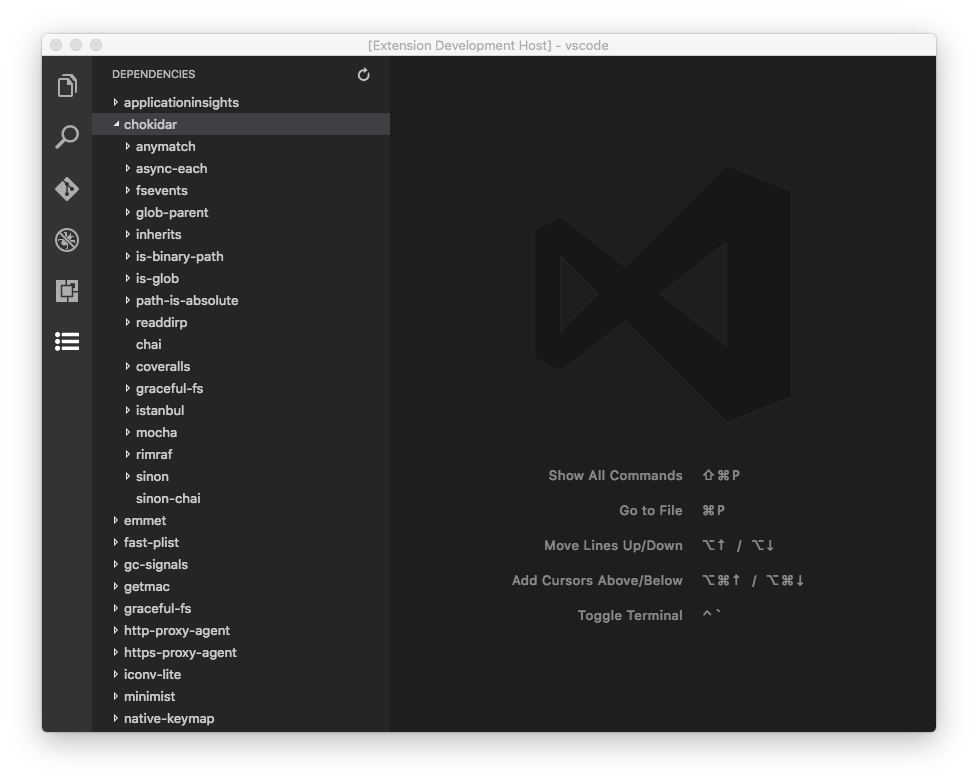

# Example - Tree Explorer

**Note**:

**This is a proposed API. It's experimental in nature and subject to change or removal without notice.**

**Currently, this API is only available when developing extensions using [Insiders](https://code.visualstudio.com/insiders) version of VS Code. Packaged extensions using this API won't run. Please refrain from publishing any extensions using this API.**

The Tree Explorer API allows you to create customized Tree Explorers, similar to the File Explorer that comes with VS Code. A Tree Explorer extension adds an icon to the Activity Bar and creates a custom View when the icon is clicked.

From a high level, extension defines an `explorer` contribution, where it specifies a View label, an icon and a provider id. During the activation, extension calls `vscode.window.registerTreeExplorerNodeProvider` with the specified provider id. VS Code then asks the registered provider to provide necessary information for rendering the Tree Explorer View.

The remaining document assumes that you are familiar with normal [extension development](https://code.visualstudio.com/docs/extensions/overview) for VS Code.

## Example - Dependency Tree Explorer

We'll show you an example of a Dependency Tree Explorer:



To get it running, do the following:

- Clone this repository
- `cd tree-explorer-sample`
- Install dependencies with `npm install`
- Run `Launch Extension` in the Debug View

By default the Explorer wouldn't be displayed on Activity Bar. Find `View: Toggle Custom Explorer` in Command Palette and choose your Explorer to enable it.

### The Structure of Tree Explorer extension

First, let's take a look at `package.json`. There are a few interesting bits:

```json
{
  "enableProposedApi": true,
  "contributes": {
    "explorer": {
      "treeLabel": "Dependencies",
      "icon": "media/dep.svg",
      "treeExplorerNodeProviderId": "depTree"
    }
  }
}
```

- `enableProposedApi` tells VS Code we acknowledge its experimental nature and would like to play with it.
- `contributes.explorer` specifies
    - A label that will appear at the top of the View
    - The path to a svg icon that will appear at the Activity Bar
    - A provider id which we'll use in `vscode.window.registerTreeExplorerNodeProvider`

`typings/vscode.proposed.d.ts` defines the preview API, and is pulled from VS Code's GitHub repository: https://github.com/Microsoft/vscode/blob/master/src/vs/vscode.proposed.d.ts

Let's jump to `src/extension.ts` and take a look at the code.

### The Implementation of a TreeExplorerNodeProvider

A `TreeExplorerNodeProvider` implements two required methods and three optional methods:

```ts
interface TreeExplorerNodeProvider<T> {
  provideRootNode(): T | Thenable<T>;
  resolveChildren(node: T): T[] | Thenable<T[]>;

  getLabel?(node: T): string;
  getHasChildren?(node: T): boolean;
  getClickCommand?(node: T): string;
}
```

The type `T` is the class of each node. `provideRootNode` provides the invisible node that represents the root of the tree. `resolveChildren` will be invoked when an expandable node is clicked upon, or invoked with the root node as argument when the Activity Bar icon is clicked.

The three optional methods are used for extracting relevant information used for rendering the tree. `getLabel` returns the label for each node, `getHasChildren` determines if each node is expandable, and `getClickCommand` returns a string that represents the command that should be executed when a node is clicked upon. When these functions are not provided, VS Code will use these default values:

- `node.toString()` as `label`
- `true` as `hasChildren`
- `null` as `clickCommand`

In our dependency example, the node is defined as an union type:

```ts
type DepNode = Root // Root node
             | Node // A dependency installed to `node_modules`
             | Leaf // A dependency not present in `node_modules`
             ;
```

A `Node` is a dependency that still has `dependencies` or `devDependencies` in its `package.json`. A `Leaf` is a dependency that depends on no other packages.

In our `DepNodeProvider`:

```ts
provideRootNode(): DepNode {
  return new Root();
}

resolveChildren(node: DepNode): Thenable<DepNode[]> {
  if (!this.workspaceRoot) {
    vscode.window.showInformationMessage('No dependency in empty workspace');
    return Promise.resolve([]);
  }

  return new Promise((resolve) => {
    switch(node.kind) {
      case 'root':
        const packageJsonPath = path.join(this.workspaceRoot, 'package.json');
        if (this.pathExists(packageJsonPath)) {
          resolve(this.getDepsInPackageJson(packageJsonPath));
        } else {
          vscode.window.showInformationMessage('Workspace has no package.json');
          resolve([]);
        }
        break;
      case 'node':
        resolve(this.getDepsInPackageJson(path.join(this.workspaceRoot, 'node_modules', node.moduleName, 'package.json')));
        break;
      case 'leaf':
        resolve([]);
    }
  });
}
```

`provideRootNode` simply provides a `Root` node. `resolveChildren` behaves differently accordingly to the type of the node to resolves children for:

- `Root`: read `package.json` in `${workspaceRoot}`, and return its `dependencies` and `devDependencies`.
- `Node`: read `package.json` in `${workspaceRoot}/node_modules/${node.moduleName}`, and return its `dependencies` and `devDependencies`.
- `Leaf`: `Leaf` isn't expandable and this case shouldn't happen. We return an empty array.

We also implement `getLabel`, `getHasChildren`, `getClickCommand` to:

- Let each `Node` and `Leaf` display its `moduleName` as the label on the tree node.

  ```ts
    getLabel(node: DepNode): string {
      return node.kind === 'root' ? '' : node.moduleName;
    }
  ```

- Make `Leaf` unexpandable.

  ```ts
  getHasChildren(node: DepNode): boolean {
    return node.kind !== 'leaf';
  }
  ```

- Invoke `extension.openPackageOnNpm` when a `Leaf` is clicked.

  ```ts
  getClickCommand(node: DepNode): string {
    return node.kind === 'leaf' ? 'extension.openPackageOnNpm' : null;
  }
  ```

## Implementation Considerations

#### Icon

To ensure UI consistency with other Views, you should provide a 32x32 SVG icon with transparent background as `explorer.icon` in package.json.

#### Long running `resolveChildren`

If `resolveChildren` could take very long, you should let it return a promise, and VS Code will show a progress bar as the promise gets resolved.

#### Error handling

We suggest that you handle errors promptly and notify the user using `vscode.window.showInformationMessage` if needed. In our Dependency example, we check for package.json in the root of the workspace. If it doesn't exist, we'll show an information message `Workspace has no package.json`. In empty workspace, we show a message `No dependency in empty workspace`.

## Common Questions

**Q: Will it be possible to access the DOM to add arbitrary UI using this API?**

**A:** No, you can read about [our approach to extensibility here](https://code.visualstudio.com/docs/extensions/our-approach).

**Q: Can I add an Outline View/Symbol Tree View using this API?**

**A:** We plan to include an API where language services could register a provider for Outline View items, similar to the existing [`DocumentSymbolProvider`](https://code.visualstudio.com/docs/extensionAPI/vscode-api#DocumentSymbolProvider). Please refrain from using this API to make Outline Views.

**Q: Can I have functionality X?**

**A:** We realize this API in its current form is limiting, and we are planning to evolve it. You can track our progress in this [GitHub issue](https://github.com/Microsoft/vscode/issues/15485). If you have ideas about how we could improve this API, please feel free to chime in.
