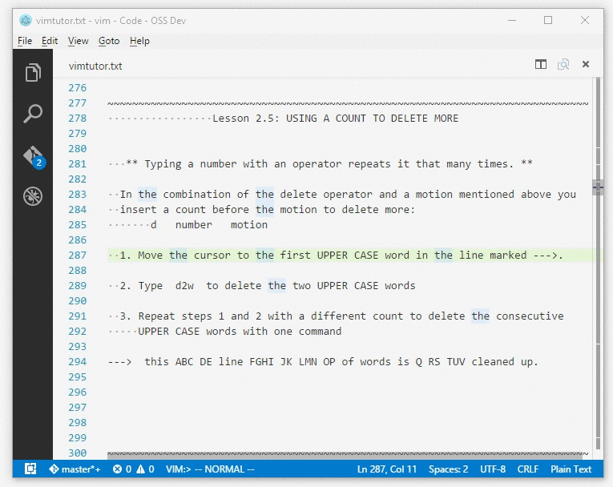

# VSCode vim sample

This is an extension sample showing how vim emulation could be implemented in a VS Code extension.

## Approach

### Typing

* When a key is pressed, VS Code gets a `keydown` event. The `keydown` event contains information about modifier keys (`ctrl`, `alt`, etc.) and about the key code. The `keydown` event does not contain information about what character would get produced and not all `keydown` events produce characters.
* The `keydown` event runs through the keybinding rules and the first rule that matches gets executed. This allows to bind commands to key combinations that would usually not produce visual characters.
* An extension should generally not add rules for key combinations that might produce characters (e.g. don't add rules for `"a"`, `"shift+a"` or `"ctrl+alt+o"`, as these key combinations will not necessarily produce the same characters under different keyboard layouts).
* When a `keydown` is not matched by any keybinding rule, it might produce a character. This is dispatched to the `type` command.
* It is therefore possible for an extension to **overwrite** the `type` command and handle characters instead of the VS Code editor.
* There is a `default:type` command that maps to the VS Code editor's type handler in case an extension wishes to delegate back typing to VS Code.
* There is another command, `replacePreviousChar` that you should be aware of. On the Mac it is possible to generate certain accented characters by long pressing a key. When this happens, a `replacePreviousChar` command is invoked containing the new characters and the number of characters that should be replaced before.
* At this time, `type`, `replacePreviousChar`, `paste` and `cut` are dispatched through the keybinding rules. There are [other internal VS Code editor commands](https://github.com/Microsoft/vscode/blob/main/src/vs/editor/browser/view/viewController.ts) (such as those coming in from mouse operations) that are not dispatched and cannot be at this time overwritten from an extension. From writing this sample, I haven't found the need to overwrite them, but if you have a use-case where that would make sense, please open an issue on the vscode repo.

### Cursor Style

* The `TextEditorOptions` has a `cursorStyle` property that allows to change the cursor style programmatically.

### Keybinding contexts

* There is a new command, `setContext`, that can be invoked with two arguments, a key and a value. It allows to add custom properties to the keybinding conditions.

## Running the Sample

> Note: You need to run from VS Code source, as the 0.10.12 version is not yet released.

Disclaimer: I am not a vim user, I tried out vimtutor, lesson by lesson, and added as many concepts to this sample until I kept finding gaps in the VS Code API. Here are the things I've added (my understanding of their functioning from vimtutor):

Motions:
* `w` - next word start
* `e` - next word end
* `$` - end of line
* `0` - start of line
* `h` - left
* `j` - down by `n` lines
* `k` - up by `n` lines
* `l` - right
* `G` - go to last line
* `gg` - go to first line
* `g0` - go to start of screen line
* `g^` - go to first non whitespace character of screen line
* `gm` - go to middle of screen line
* `g$` - go to end of screen line
* `gj` - down by `n` screen lines
* `gk` - up by `n` screen lines
* `H`  - `nth` line from top of the view
* `M`  - center line of the view
* `L`  - `nth` line from bottom of the view

Commands/Operators:
* `x` - delete char under cursor
* `i` - insert
* `a` - append
* `A` - append end of line
* `d` - delete
* `p` - put
* `r` - replace
* `R` - replace mode
* `c` - change
* `v` - visual modes

Other:
* ensures cursor in normal mode is always on top of the last char.
* honors `editor.wordSeparators` for word related motions.
* parses repeated motions and commands (e.g. `2d2w` to delete twice two words)
* switches cursor style based on mode.
* delegates insert mode typing back to the VS Code editor.
* supports any keyboard layout.
* when making a selection in an editor, it enters visual mode.
