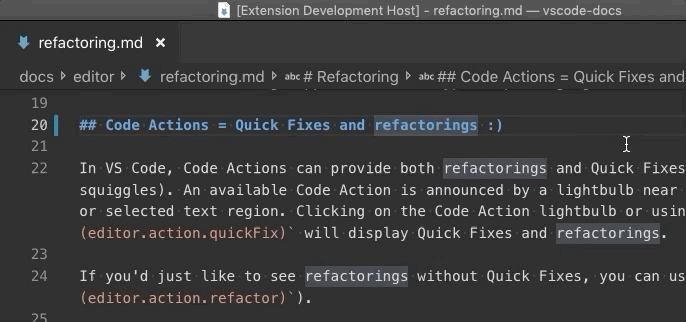
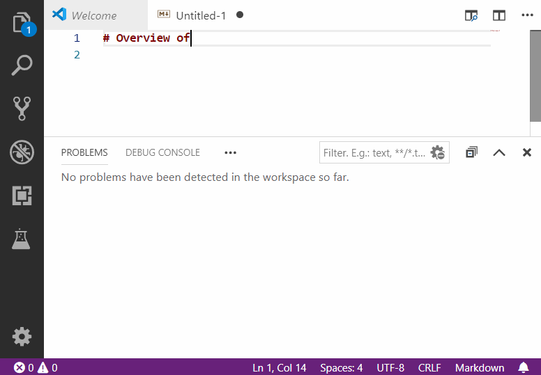

# Code Action Provider Sample

This sample shows how to provide code actions in the editor. Code actions are used to implement quick fixes and [refactoring](https://code.visualstudio.com/docs/editor/refactoring) in VS Code.

The sample uses the [`CodeActionProvider`](https://code.visualstudio.com/api/references/vscode-api#CodeActionProvider) api to implement a simple set of code actions that convert `:)` to a smiley emoji in markdown files:

Second example of code action provider shows how to associate code actions with diagnostic (e.g. compilation) problems.

## VS Code API

### `vscode` module

- [`languages.registerCodeActionsProvider`](https://code.visualstudio.com/api/references/vscode-api#languages.registerCodeActionsProvider)
- [`Diagnostic.code`](https://code.visualstudio.com/api/references/vscode-api#Diagnostic)
- [`CodeActionContext.diagnostics`](https://code.visualstudio.com/api/references/vscode-api#CodeActionContext)
