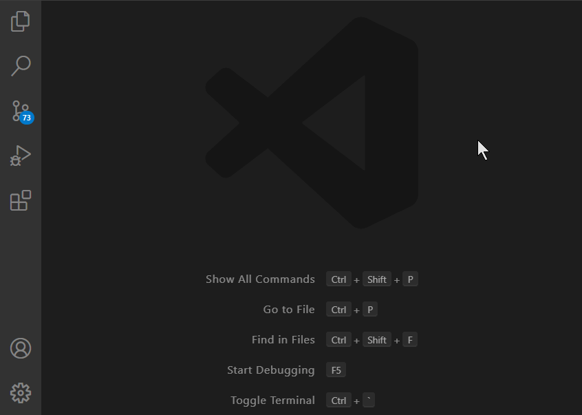
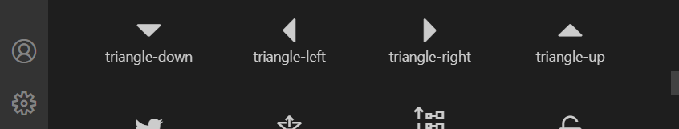

# Webview with Codicons

Demonstrates loading [codicons](https://github.com/microsoft/vscode-codicons) in a [webview](https://code.visualstudio.com/api/extension-guides/webview).

## VS Code API

### `vscode` module

- [`window.createWebviewPanel`](https://code.visualstudio.com/api/references/vscode-api#window.createWebviewPanel)

## Running the example

- Open this example in VS Code 1.47+
- `npm install`
- `npm run watch` or `npm run compile`
- `F5` to start debugging

Run the `Webview Codicons: Show Webview Codicons` command to create the webview.

While similar user experience can be achieved by including image files into your extension and using the `` tag in the Webview HTML, using Codicons provides far simpler way to support themes. While on the _Webview Codicons_ panel, try switching between the light and dark theme.



## How to use Codicons

First, include the `vscode-codicons` package into the `dependencies` in `package.json`:

```json
"dependencies": {
"vscode-codicons": "0.0.12"
}
```

Second, refer to the Codicons font and styles from your Webview HTML:

Get resource paths:

```typescript
const styleUri = webview.asWebviewUri(vscode.Uri.joinPath(extensionUri, 'media', 'styles.css'));
const codiconsUri = webview.asWebviewUri(vscode.Uri.joinPath(extensionUri, 'node_modules', 'vscode-codicons', 'dist', 'codicon.css'));
const codiconsFontUri = webview.asWebviewUri(vscode.Uri.joinPath(extensionUri, 'node_modules', 'vscode-codicons', 'dist', 'codicon.ttf'));
```

Declare the Codicons resources in the Content Security Policy and link the stylesheets into your HTML:

```html
<meta http-equiv="Content-Security-Policy"
	content="default-src 'none'; font-src ${codiconsFontUri}; style-src ${webview.cspSource} ${codiconsUri};">

<link href="${styleUri}" rel="stylesheet" />
<link href="${codiconsUri}" rel="stylesheet" />
```

Last, add any Codicon into your HTML:

```html
<i class="codicon codicon-check"></i>
```

## Styling and interacting with codicons

Icons can be styled as any other HTML content:

```html
<div class="styledIcon"><i class="codicon codicon-check"></i> check</div>
```

```css
div.styledIcon .codicon {
    font-size: 50px;
    color: green;
    padding: 3px;
}
```

However, it is recommended to use CSS variable to reference a VS Code color token,
rather than hard-coding any concrete color.

```css
    color: var(--vscode-debugIcon-startForeground);
```


