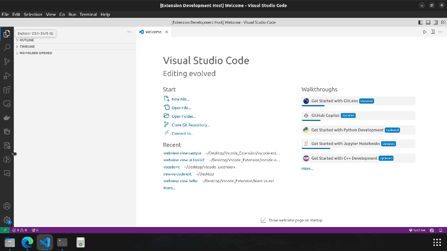

# Webview-view with UI Toolkit Sample

This is a basic example to illustrate on how to use simple webview-view along with UI Toolkit setup

## Demo

## VS Code API

### `vscode` module

- [`commands.registerCommand`](https://code.visualstudio.com/api/references/vscode-api#commands.registerCommand)
- [`window.showInformationMessage`](https://code.visualstudio.com/api/references/vscode-api#window.showInformationMessage)
- [`window.registerWebviewViewProvider`](https://code.visualstudio.com/api/references/vscode-api#window.registerWebviewViewProvider)

### Contribution Points

- [`contributes.commands`](https://code.visualstudio.com/api/references/contribution-points#contributes.commands)
- [`contributes.viewsContainers`](https://code.visualstudio.com/api/references/contribution-points#contributes.viewsContainers)
- [`contributes.views`](https://code.visualstudio.com/api/references/contribution-points#contributes.views)

## Running the Sample

- Run `npm install` in terminal to install dependencies
- Run the `Run Extension` target in the Debug View or Press F5. This will:
  - Start a task `npm: watch` to compile the code
  - Run the extension in a new VS Code window
- Choose the Hello Icon from the activity bar
- Click On `Click me` button to see the information message.
